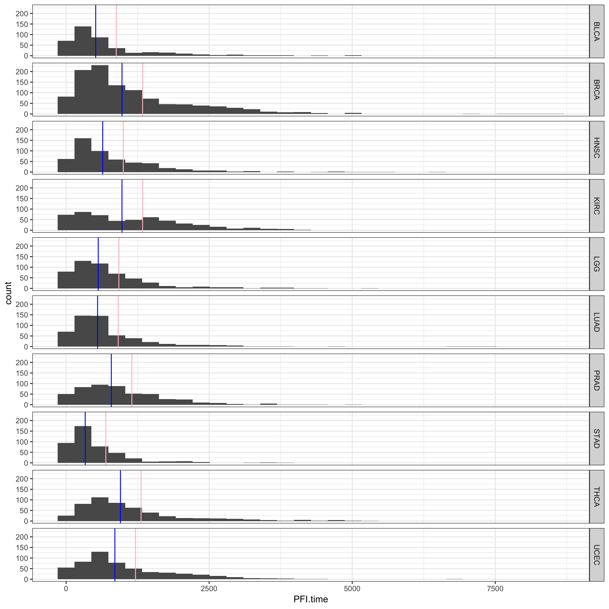

```latex
\documentclass{article}
\begin{document}
\title{Optimizing Cancer Prognosis Through Iterative Heterogenous Data Combinations and Machine Learning}

% Possible alternate titles:

\author{%
  \parbox{\linewidth}{
      \vspace{5 mm}
      Nathan B. Mella,\textsuperscript{1}
      Tyler Heaton,
      Stephen R. Piccolo\textsuperscript{*} \\
      \vspace{5 mm}
  }%
}


\date{%
      1 - Department of Biology, Brigham Young University, Provo, UT, USA \\%

      \* - Please address correspondence to S.R.P. at stephen\_piccolo@byu.edu.%
}

\maketitle
\newpage
\pagenumbering{arabic}
\raggedright
\end{document}
```

# Abstract

*Background*:

Accurate cancer prognosis techniques have potential to significantly aid physicians, patients, and patients' family members. “It can help
 stratify patients into different risk groups and choose both treatment and surveillance strategies”[@yuanAssessingClinicalUtility2014]. However, cancer is
  complex and accurate predictions are difficult to make. "Human evaluation of pathology slides cannot accurately predict
   patients’ prognoses[@yuPredictingNonsmallCell2016]." To deal with this complexity, researchers have begun to explore
   machine learning techniques[@piccoloClinicalMolecularModels2013].
Machine learning (ML) is a subdiscipline of artificial intelligence that uses mathematics to detect patterns in massive 
data sets and draw conclusions from those patterns. The more data the algorithm receives, the more intelligent the ML program
 becomes. If an algorithm identifies clinically relevant patterns in cancer data, it may become capable of making highly 
 accurate predictions. Advances in our ability to collect clinical and molecular data from cancer patients have led to 
 increased interest in using ML algorithms to estimate cancer outcomes such as prognosis[@cruzApplicationsMachineLearning2006]. 
However, because molecular data is expensive, researchers and clinicians must prioritize which types of data to collect. 
Additionally, little research has been done to understand which types and/or combinations of molecular data provide the 
best predictions. Furthermore, little is known about which ML algorithms work best with such combinations.

*Methods*: 
Our aim is to perform an extensive benchmark analysis using data from 5,000+ cancer patients from The Cancer Genome Atlas,
 a public resource that has 6 types of molecular data (plus clinical data) for each patient. We will apply state-of-the-art
  ML algorithms to data from 10 different cancer types to predict the progression free interval (PFI) and
   overall survival time (OS) after diagnosis of cancer patients.

*Results*:

*Conclusions*: 
Understanding how to select, combine, and process clinical and molecular data could have radical implications for cancer
 patients and researchers. Such discoveries will help researchers understand the fundamental factors that lead to cancer 
 survival rates, drastically save researchers’ money, and provide more accurate predictions, leading to better treatments
  for patients.

\vspace{5 mm}
Keywords: Prognosis, Machine Learning, Heterogeneous Data, Combinations, Classification 

\newpage

# Introduction

Large volumes of recently produced clinical and molecular data provide unprecedented opportunities for physicians and 
researchers to advance precision medicine--enabling physicians to tailor medical decisions to patients[@huangOpenSourceMachinelearning2017]. However, this advancement will only occur
if we can successfully identify relationships between these molecular measurements and patient outcomes. A particularly import outcome to
understand is the Progression Free Interval (PFI) of a tumor. The PFI represents "the date of diagnosis until the date of
 the first occurrence of a new tumor event (NTE), which includes progression of the disease, locoregional recurrence, 
 distant metastasis, new primary tumor, or death with tumor."
 PFI is valuable to predict because it represents how effect treatments work, and it's less susceptible to lurking variables 
 that other outcome predictions include. For example, Overall Survival (OS) is easy to define but death by other causes unrelated to
 cancer causes this outcome variable to become confounded.

Many researchers are attempting to use high-throughput molecular profiles for precision medicine and procure biological samples to test
this ability. Many types of high-throughput molecular profiling are in wide use. These include: micro RNA data (miRNA), mRNA data, copy number variant (CNV), somatic
mutations (SM), DNA Methylation, and Reverse Phase Protein Array (RPPA). Ideally, these researchers would perform many types of molecular profiling
 and use all of that data in combination to improve predictive accuracy.
However due to cost limitations researchers typically must choose one or two types of molecular profiling to use for these predictions.
For example, to perform RNA sequences for a cohort of 200 patients, it would costs $100,000 because each cohort costs roughly $500.
 So it is critical to prioritize budget decisions based on what will provide the best return on investment. 

Thus, we performed an extensive benchmark analysis using data from the cancer genome atlas and evaluated the predictive potential of six
molecular data types and compared them against each other and against the predictive performance of clinical data. We evaluated ten different machine classification algorithms
to see which algorithms perform best for each type of data. In addition, we evaluated the potential to combine one or more molecular data types with clinical data and evaluated 
each algorithms ability to classify PFI status based on these heterogeneous combinations.


NOTES
 - Tell a story
      **BIG NEED**
      Precision Medicine Promises to enable physicians to tailor medical decisions to individual patients. -> Clinical & Molecular Measurements
      -> Molecular Measurements in a high throughput manner. -> Wealth of data gives oppportunity to advance precision medicine if we can succesfully identify 
      relationships between these molecular measurements and patient outcomes. -> PFI and why this is valueable to predict. 

      **SPECIFIC PROBLEM**
    
      
      **HOW WE'RE ADDRESSING THE PROBLEM and HIGH LEVEL SUMMARY OF METHODS AND RESULTS**

      (Allude to what other have done. At a high level how is what we've done unique and different from what others have done)

     and make accurate cancer outcome predictions using ML. “Machine learning is 
    not new to cancer research”[@cruzApplicationsMachineLearning2006]. However, ML in cancer prognosis is still relatively new[@cruzApplicationsMachineLearning2006], and there seems to be incredible
     potential for ML in cancer prognosis with the rapid development of genomic, proteomic and imaging technologies. Molecular
      biomarkers such as somatic mutations, tumor proteins, and the chemical environment of the tumor may serve as powerful predictive indicators[@cruzApplicationsMachineLearning2006].
    With this incredible potential, we anticipate that more researchers will study cancer prognosis through ML. One recurring
     issue, however, is that when researchers want to predict cancer patient outcomes and survival rates using molecular or 
     clinical data, they typically have to prioritize what type of data to collect due to cost. Furthermore, few researchers
      have studied which types of molecular data and/or which combinations of such data provide the best predictions. This 
      makes it imperative that we more fully understand whether certain ML algorithms work better for specific types of molecular data.

(Site Johnathon's Article on why to separate by cancer types)

# Methods

## Data preparation and filtering

**Core Data Set Compilation.** We downloaded overall survival data and progression free interval data from 
 [cell.com](https://www.cell.com/cms/10.1016/j.cell.2018.02.052/attachment/f4eb6b31-8957-4817-a41f-e46fd2a1d9c3/mmc1.xlsx) [@liuIntegratedTCGAPanCancer2018].
  We obtained the clinical variables and mRNA expression data from
   [the gene expression omnibus](ftp://ftp.ncbi.nlm.nih.gov/geo/series/GSE62nnn/GSE62944/suppl) [@ahmanAlternativePreprocessingRNASequencing2015], 
   and we obtained the molecular data (including DNA methylation, miRNA, somatic mutation, and protein expression) 
   from the Pan-cancer project on [xena](https://pancanatlas.xenahubs.net/download) [@thecancergenomeatlasresearchnetworkCancerGenomeAtlas2013],
   [@goldmanUCSCXenaPlatform2018].

##### Data filtering

**INDICATE WHICH TECHNOLOGY WAS USED FOR PROFILING**

**miRNA Data.** We downloaded our raw miRNA data from [xena](https://xenabrowser.net/datapages/?dataset=pancanMiRs_EBadjOnProtocolPlatformWithoutRepsWithUnCorrectMiRs_08_04_16.xena&host=https%3A%2F%2Fpancanatlas.xenahubs.net&removeHub=https%3A%2F%2Fxena.treehouse.gi.ucsc.edu%3A443) [@goldmanUCSCXenaPlatform2018].
 All of our data had previously been normalized for 
batch effects [@leekTacklingWidespreadCritical2010]. The bulk of the samples were processed on the HiSeq platform using the multiMACs protocol.
 We excluded data from all non tumor tissue ID's in our analysis. We also excluded from our analysis patients
  who didn't contain data across all data types so that each data type could be
 fairly evaluated in its predictive abilities. We averaged together data values for duplicate tumor IDs whenever present.
 We truncated tumor tissue ID's to twelve characters so that IDs would match across all data sets. We excluded all features 
 missing data for more than 20% of the patients. We additionally excluded all tumor IDs missing more than 20% of the 
 kept features. We saved our data with a ".ttsv" file extension so that our software tool Shinylearner would transpose 
 the data upon processing.
 
**Copy-number Variation (CNV)** We additionally downloaded CNV data from [xena](https://xenabrowser.net/datapages/?dataset=broad.mit.edu_PANCAN_Genome_Wide_SNP_6_whitelisted.gene.xena&host=https%3A%2F%2Fpancanatlas.xenahubs.net&removeHub=https%3A%2F%2Fxena.treehouse.gi.ucsc.edu%3A443) [@goldmanUCSCXenaPlatform2018].
 This data had previously been filtered to removed all normal samples and convert segment data to gene level CNV value by
 segment-size-weighted gene average. The samples were processed with SNP6 array platform. Germline cnv was also previous deleted.
  We additionally filtered this data to limit the analysis to tumor samples, and patients
 who have data across all data types. We truncated our tumor ID's to twelve characters similar to miRNA data. 
 Finally, we separated patients into their respective cancer types and saved them into individual ".ttsv" files for each cancer type.
 
**Protein Expression (RPPA)** We downloaded RPPA data from [xena](https://xenabrowser.net/datapages/?dataset=TCGA-RPPA-pancan-clean.xena&host=https%3A%2F%2Fpancanatlas.xenahubs.net&removeHub=https%3A%2F%2Fxena.treehouse.gi.ucsc.edu%3A443) [@goldmanUCSCXenaPlatform2018]. 
 We limited our analysis to tumor samples. The raw dad had many missing values, so if any protein was missing data for more than 20% of tumor ID's, we excluded the tumor ID.
 We truncated tumor ID's to twelve characters and averaged the data of duplicate tumor ID's together. 
 
 **DNA Methylation** We downloaded DNA Methylation data from xena [@goldmanUCSCXenaPlatform2018]. The microarrays that we used to generate the data
 have 450,00 probes on them. there are roughly 20 probes per gene. We only kept DNA Methylation data probes if they were located within 300 nucleotides of the transcription start site 
 (TSS) because of the inconsistency of probes far from the TSS. DNA methylation profile was measured experimentally using the Infinium HumanMethylation450 array platform.
  We average values together whenever we found duplicated tumor ID's.  
 
 **mRNA Data** We dowloaded our mRNA data from the [the gene expression omnibus](ftp://ftp.ncbi.nlm.nih.gov/geo/series/GSE62nnn/GSE62944/suppl) [@ahmanAlternativePreprocessingRNASequencing2015], 
 We truncated tumor ID's together and averaged duplicated values together. Similar to all of the previous data filtrations, we only kept data for the cancer types specified in our analysis.
 
**Somatic Mutation variables (SM)** We downloaded SM data from [gdc.cancer.gov](https://api.gdc.cancer.gov/data/1c8cfe5f-e52d-41ba-94da-f15ea1337efc) [@ScalableOpenScience]
 and only used the open access data. We only kept SM variables if they contained a "PASS" in the FILTER column, if NCALLERS was greater than or equal to 3,
 if impact was either moderate or high. Furthermore, we only kept mutation variables if they matched at least one of the following 
 [criteria](https://uswest.ensembl.org/info/genome/variation/prediction/protein_function.html): 
 - The SIFT entry was "deleterious" 
 - The SIFT entry was "deleterious low confidence" the PolyPhen entry was either blank or "not benign"
 - The PolyPhen entry was "probably damaging"
 - The PolyPhen entry was "possibly damaging" and the SIFT entry was either blank, "not tolerated" or "tolerated low 
 confidence"
 - There was no SIFT or PolyPhen data.
 
 After filtration, we summarized the somatic mutation data at the gene level. If a given tumor had at least one mutation
  that passed the above criteria, we assigned it
 a value of 1. Otherwise, we assigned it a value of 0. If a given gene was mutated in fewer than 2 samples from each cancer
  type, we excluded it from our analysis.
 
 **Clinical features** We dowloaded our clinical data from the [the gene expression omnibus](ftp://ftp.ncbi.nlm.nih.gov/geo/series/GSE62nnn/GSE62944/suppl) [@ahmanAlternativePreprocessingRNASequencing2015].
 We converted progressive categorical variables such as staging into integer values in order to maintain the progressive relationship. For example, we converted ajcc tumor pathological
 values of T1, T2a, and T2b to 1, 2, and 2 respectively. All categorical values with Roman Numeral representations
 were converted to their respective integer values. We only kept categorical values if there were at least 5 or more 
 patients in that category. We merged interchangeable categories (for example, categories that say yes in differing ways).
 Any tumor site with fewer than 10 values across patients for LGG we called "Other." In the race column, we merged "ASIAN," "NATIVE
 HAWAIIAN OR OTHER PACIFIC ISLANDER," and "AMERICAN INDIAN OR ALASKA NATIVE" into the category "OTHER." For the
 tobacco smoking history indicator, we combined "Current Reformed Smoker, Duration Not Specified" with "Current reformed
  smoker for < or = 15 years." With LUAD and the anatommic organ subdivision column, we combined "Other (please specify)" and
  "Bronchial" into a category called "Other." Hemoglobin values of low, normal, and elevated were converted to 1, 2, and 3.
  
 **Scaling, imputing, and one-hot encoding.** We scaled the following data types using the sklearn robust scaler function: Clinical, mRNA Expression, RPPA, 
 and miRNA Expression data. We scaled clinical data before one-hot encoding so that the binary features wouldn't be affected.
 We ran an imputing function on all of our data sets to insure that we didn't have any missing values. Our imputing function
 can be found on the [ShinyLearner Github Repository](https://github.com/srp33/ShinyLearner/blob/master/scripts/Impute.R) [@ShinyLearnerContainerizedBenchmarking].
 We always imputed data first, then scaled it. 

**Dichotomization of outcome variables.** Progression Free Interval (PFI) time values were converted to either long PFI (LPFI) or short PFI (SPFI) in the context of 
 the specific cancer type. Values were assigned by dividing tumor samples into their respective cancer types, and then
 calculating the average PFI time for that cancer type. Patients whose PFI times fell within 6 months of the average greater or 
 less than the average where excluded. Patients who were less than 6 months of the average and had a tumor were assigned
 SPFI while any patients greater than 6 months of the average were assigned LPFI. Overall survival (OS) times were
 assigned classification variables using a similar approach. However, tumor events were disregarded in assigning 
 Short Term Survival (STS) from Long Term Survival (LTS).
 
 **Cancer type selection.** Cancer types were selected primarily from the recommendations from 
 [Jianfang Liu, et al.](https://www.cell.com/action/showPdf?pii=S0092-8674%2818%2930229-0)  in their article in Cell on which cancer types are appropriate for
 making PFI outcome predictions [@liuIntegratedTCGAPanCancer2018]. One can find their recommendations by looking at Table 3 of their article.
 We further decreased our cancer type selection to only the cancer types for which we had 100 patients. We additionally 
 decided not to evaluate SKCM because roughly 2/3 of these tumors are metastases to other locations in the body.
 
 (What specific recommendation did we follow?)

### Quantitative analysis and visualization

**Model training and performance comparision**. For each core set, we trained and tested our data using a nested k-fold
cross validation for parameter optimization. All hyper-parameters were chosen based on inner-test fold performance.
 We used 5 outer folds, 5 inner folds, and tested each data set with 5 iterations. We used Area Under the Receiver 
 Operating Curve (AUROC) as our core metric in assessing algorithm performance because it is capable of handling imbalanced classes.
  We used the [ShinyLearner](https://github.com/srp33/ShinyLearner) [@ShinyLearnerContainerizedBenchmarking]] software to perform classification.
   We used eight machine learning models to train and
 test our data from the following packages:
 1. sklearn (python package): [@pedregosaScikitlearnMachineLearning]
    - random forests (RF) [@RandomForestsSpringerLink]
    - support vector machines (SVM) [@LIBSVMLibrarySupport]
    - k-nearest neighbors (KNN) [@omohundroFiveBalltreeConstruction]
    - logistic regression [@AppliedLogisticRegression]
 2. mlr (R package): [@bischlMlrMachineLearning]
    - glmnet [@friedman2009glmnet]
    - naiveBayes [@mccallumComparisonEventModels]
    - xgboost [@henXGBoostScalableTree2016]
 3. weka: [@maimonDataMiningKnowledge2010], [@WekaAMachineLearning]
    - Voting Feature Intervals (VFI) [@demirozClassificationVotingFeature1997]
 
 The sklearn and mlr packages require are data to be trained in a TSV file format. The weka package required files to be 
 converted into a ARFF format.
 
 To assess the predictive power of integrating heterogeneous molecular data with clinical variables, we 
 used an iterative combinatorial approach. We first calculated the AUROC for each data type, cancer type, algorithm, fold,
 and iterations. We first average the AUROC values across the cross-validation folds for a given iterations, and then averaged across
 the iterations. For each machine learning algorithm and 
 cancer type, we ranked the various types of molecular data and clinical features. We then averaged the ranks across cancer
 types to determine which type of data had the highest rank on average. We then combined the "winning" data set with each of our other
 data sets and measured their AUROC. We continued this process until we combined all 7 of our data types. Combinations
 were mostly unique for each algorithm. Here was the sequential order of data combinations for each algorithm:
 
 | Order Added | random forest | svm | knn | logistic regression | glmnet | naiveBayes | xgboost | VFI |
 |-------------|-----|----------------|-----|---------------------|--------|------------|---------|-----|
 |      1      | Clinical | Clinical | Clinical | Clinical | Clinical | Clinical | Clinical | Clinical |
 |      2      | SM | SM | miRNA | miRNA | RPPA | RPPA | SM | SM |
 |      3      | mRNA | miRNA | DNA Methylation | SM | miRNA | mRNA | mRNA | mRNA |
 |      4      | RPPA | DNA Methylation |  |  |  |  |  |  |
 |      5      | miRNA | RPPA |  |  |  |  |  |  |
 |      6      | CNV | mRNA |  |  |  |  |  |  |    
 |      7      | DNA Methylation  | CNV |  |  |  |  |  |  | 

(just show which data types tend to be added) 

**Testing our recommendations.** In order to asses how usesful our recommendations would be to other researchers, we first ran our analysis for 7 out of the 10
cancer types. We randomly selected these 7 cancer types using a random seed. After determining our recommended data combinations
for each algorithm. We assessed the predictive gains from our recommendations with the 3 remaining cancer types.

**Accession codes and Replication.** All core clinical and genomic/proteomic data used to construct survival models, as well as the training and test data 
set splits, are available on Open Science Framework (https://osf.io/3snep/). All code used to generate data and construct survival models
 are available on  [github](https://github.com/natemella/DataTypesAnalysis). All models can be ran on Docker as described on our github site.
Any user can replicate our entire project including the downloading and filtration of our data by running copying and pasting
 the following commands into the terminal of a super-computer linux system while inside of our cloned repository.


The full Pan-Cancer data set is also available at the (Open Science Framework) https://osf.io/3snep/.
 Dichotomized survival and PFI data were deposited https://osf.io/3snep/.

# Results

**Assesment of the prognostic power of diverse molecular data.**
We focused on ten TCGA cancer types: 
Bladder Urothelial Carcinoma (BLCA),
Breast invasive carcinoma (BRCA),
Head and Neck squamous cell carcinoma (HNSC),
Kidney renal clear cell carcinoma (KIRC),
Brain Lower Grade Glioma (LGG ),
Lung adenocarcinoma (LUAD),
Prostate adenocarcinoma (PRAD),
Stomach adenocarcinoma (STAD),
Thyroid carcinoma (THCA), and
Uterine Corpus Endometrial Carcinoma (UCEC). Cancer types were selected primarily from the recommendations from 
 [Jianfang Liu, et al.](https://www.cell.com/action/showPdf?pii=S0092-8674%2818%2930229-0) in their article in Cell on which
 cancer types are appropriate for making PFI predictions.
 We further decreased our cancer type selection to only the cancer types for which we had 100 patients with data across 
 all seven data types (
 (i) Clinical;
 (ii) DNA Methylation;
 (iii) mRNA expression;
 (iv) miRNA expression;
 (v) Somatic Mutations;
 (vi) protein expression: Reverse Phase Protein Array;
 (vii) Copy Number Variant (CNV);
 ). 
 We additionally decided not to evaluate SKCM because roughly 2/3 of these tumors are metastases to other locations in the body.
 
 For each core sample set, we applied a nested k-fold cross-validation for parameter optimization. We used 5 inner folds, 
 5 outer folds, and 5 iterations to asses the predictive power of individual and combinatorial molecular and clinical
 variables. We measured the predictive power using the area under the reciever operation curve (AUROC) which is a
 standard metric to compare accuracy over sensitivity in order to quanitify the discriminatory power of a classifier predictive
 model: a AUROC of 1 indicates perfect prediction accuracy and a AUROC of 0.5 is the equivalent of a random guess. 
 
  For each cancer type, the clinical-variable-only models showed substantial predictive power, with AUROCs significantly
  higher than 0.5 (range: ____ – ____ ; ). In ___ out of __ cases, the models built
   from individual molecular data sets alone showed statistically significant predictive power (Supplementary Fig. 4), 
   but in only one case, the model built from mRNA Expression data had predictive power similar to that of the 
   corresponding clinical-variable-only model .
    The relative predictive power of individual molecular data sets strongly depended on the cancer type; for example, 
    the prognostic power was much higher for STAD than for the other three cancer types. 
 
 **Table 1 overview of samples**
 
| Cancer Type| Outcome | Class | Clinical | CNV | DNA Methylation | Expression | miRNA | RPPA | SM  | Total | 
|------------|---------|-------|----------|-----|-----------------|------------|-------|------|-----|-------| 
| BLCA       | LPFI    | 92    | 82       | 92  | 92              | 91         | 92    | 72   | 92  | 64    | 
| BLCA       | SPFI    | 128   | 117      | 126 | 128             | 126        | 126   | 109  | 128 | 98    | 
| BRCA       | LPFI    | 330   | 310      | 319 | 234             | 329        | 321   | 264  | 250 | 154   | 
| BRCA       | SPFI    | 82    | 69       | 80  | 62              | 82         | 79    | 67   | 54  | 30    | 
| HNSC       | LPFI    | 153   | 134      | 148 | 153             | 141        | 151   | 95   | 140 | 82    | 
| HNSC       | SPFI    | 160   | 138      | 157 | 160             | 156        | 158   | 110  | 159 | 97    | 
| KIRC       | LPFI    | 212   | 206      | 198 | 118             | 211        | 195   | 179  | 141 | 91    | 
| KIRC       | SPFI    | 121   | 119      | 118 | 80              | 120        | 117   | 111  | 70  | 51    | 
| LGG        | LPFI    | 141   | 114      | 139 | 141             | 140        | 139   | 113  | 137 | 86    | 
| LGG        | SPFI    | 117   | 99       | 117 | 117             | 117        | 117   | 88   | 117 | 74    | 
| LUAD       | LPFI    | 121   | 119      | 118 | 102             | 121        | 119   | 94   | 118 | 74    | 
| LUAD       | SPFI    | 140   | 131      | 129 | 124             | 138        | 133   | 93   | 135 | 76    | 
| PRAD       | LPFI    | 162   | 160      | 159 | 160             | 160        | 157   | 124  | 154 | 118   | 
| PRAD       | SPFI    | 60    | 56       | 58  | 60              | 60         | 59    | 43   | 57  | 37    | 
| STAD       | LPFI    | 102   | 96       | 102 | 97              | 98         | 99    | 79   | 99  | 67    | 
| STAD       | SPFI    | 79    | 71       | 78  | 76              | 75         | 77    | 57   | 78  | 51    | 
| THCA       | LPFI    | 143   | 139      | 140 | 143             | 142        | 139   | 117  | 135 | 102   | 
| THCA       | SPFI    | 43    | 40       | 42  | 43              | 43         | 43    | 32   | 39  | 27    | 
| UCEC       | LPFI    | 160   | 155      | 153 | 96              | 159        | 152   | 119  | 111 | 59    | 
| UCEC       | SPFI    | 99    | 97       | 91  | 81              | 99         | 93    | 76   | 80  | 51    | 

Table 1 caption:

**DEFINE ALL ACRONYMS IN CAPTION AND CONVERT EVERYTHING TO ENGLISH** BLCA (Bladder Urothelial Carcinoma) BRCA (Breast invasive carcinoma)
 HNSC(Head and Neck squamous cell carcinoma) KIRC (Kidney renal clear cell carcinoma) LGG (Brain Lower Grade Glioma) LUAD (Lung adenocarcinoma)
PRAD (Prostate adenocarcinoma) STAD (Stomach adenocarcinoma) THCA (Thyroid carcinoma) UCEC (Uterine Corpus Endometrial Carcinoma).
 LPFI (Long Progression Free Interval) SPFI (Short Progression Free Interval). Class represents 
the number of patients for whom we had outcome information. Clinical represents clinical features such as age, race, tumor stage, histological stage, etc. 
CNV represents Copy Number Variant. Expression represents mRNA expression samples. miRNA represents microRNA samples. RPPA represents Reverse Phase Protein Array Assay.
SM represetns Somatic Mutations. Total is the number of patients for whom we have data across all data types.
 

**Figure 1**

Figure 1 shows all four key steps in our work flow. The four steps were carried out until all seven data types were combined together

**Graph 1**


Graph 1 caption: Pink line represents upper cut off for excluded values. Everything above the pink line was labeled LPFI.
Blue line represents the lower cut off for excluded values. Everything below the blue line was labeled SPFI. Any patients inbetween
the two values were excluded.


**Graph 2**

(convert graph to bars)

Graph 2 caption:
 - variability: AUROC, Data Types, Algorithms
 - Huge most predictive cancer types
 

**Graph 3**


Graph 3 caption:
 - While their is huge variability, random_forests tends to best among all data types when their aren't any combinations
 
**Graph 4**


Graph 4 caption:
 - The top performing data type was significantly different for each algorithm. There was a high variety in data type 
 performance. Clinical data on average was signifcantly higher than the other data types individually

**Graph 5**

(Need to split into differing facets)

Graph 5 caption:
 - As you combine data types, you can see that certain algorithms increase performance while others decrease. The highest
 average performing algorithm is glmnet. 
 
 

**Computational insights from top-performing algorithms.**
Glment is made to handle wide data frames. Zero values are excluded from the data set in order to be more memory effecient. Therefore, the increase
in data does not negatively affect the algorithm as much. We also observed that binary features such as somatic mutation data did extremely well.
The algorithm that reached the highest total AUROC was xgboost because...

**Conclusion**
 - The best combination of data types and algorithm is unique for each cancer type. The safest, cheapest data type option with 
 effective AUROC values is clinical features. 

\newpage

# Declarations

### Ethics approval and consent to participate

Brigham Young University's Institutional Review Board approved this study under exemption status. This study uses data collected from public repositories only. We played no part in patient recruiting or in obtaining consent. We have adhered to guidelines from TCGA on handling data.

### Consent for publication

Not applicable.

### Availability of data and material

The datasets generated and analyzed during the current study are available in the Open Science Framework repository (https://osf.io/3snep/).

### Competing interests


### Funding

Funding for this study was provided through Brigham Young University Graduate Studies and the Simmons Center for Cancer Research..

### Author’s contributions


### Acknowledgements

\end{document}